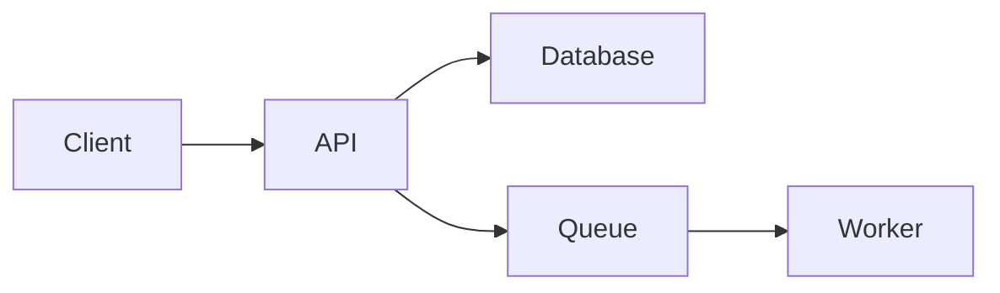

# Prompt Patterns (§6.7)

> Five well-tested MetaGPT prompt patterns, ported as **discipline conventions** for the highest-stakes skills (`create-prd`, `create-architecture`, `story-graph`, code-review). Not a runtime, not a framework — a set of markup idioms that make skill outputs more machine-parseable, reviewer-grounded, and gap-visible.

**Source decision:** plan §6.7 (tier3-positioning-brief-2026-04-22.md §7.2).

---

## The 5 patterns

| # | Pattern | Problem it solves | Applied in |
|---|---------|-------------------|------------|
| 1 | **Inline section-level meta-descriptions** | Authors skip or misunderstand what a template section is for. | All 4 sacred-doc templates + high-stakes skill Process sections |
| 2 | **"ATTENTION" preamble** | Agents treat formatting requirements as suggestions; machine-parsed outputs (story-graph.yaml, epic sharding) arrive malformed. | `story-graph`, epic/story shard skills, any skill with downstream schema consumers |
| 3 | **Forcing-function artefacts** | Agents skim / skip analysis; skipped work is invisible in the output. | Architecture diagram (mandatory Mermaid), story-graph DAG (mandatory table), review rubric (mandatory row per criterion) |
| 4 | **Tripartite code-review CoT scaffold** | Review becomes vibes-based; no line citations, no threshold gate. | `code-review`, `@reviewer` rubric-grounding |
| 5 | **Closing "Output Contract" block** | Output format drifts between runs because the spec is stated once at the top + forgotten by generation time. | Every machine-consumed skill output |

All 5 are **markup conventions** — pure markdown. No new runtime; no schema changes; no CLI surface.

---

## Pattern 1 — Inline section-level meta-descriptions

Each section of a template or Process block carries a short italicised description stating what belongs there. Authors + agents read the description BEFORE filling the section; the output's structure degrades gracefully when a section is unclear, because the meta-description stays in place until replaced.

**Canonical form:**

```markdown
## 4. Non-Functional Requirements

*What performance / security / availability / compliance constraints shape the
architecture? One bullet per constraint with a measurable target (e.g. "p95
API latency < 200ms" rather than "API should be fast"). Constraints without
targets are vibes, not requirements.*

- …
- …
```

**Why italic:** visually distinct from body prose, doesn't collide with quote blocks, renders cleanly in both Markdown viewers and agent prompts.

**Applied in:** sacred-doc templates (`context.md`, `tech-stack.md`, `prd.md`, `architecture.md`), Process sections of high-stakes skills.

---

## Pattern 2 — "ATTENTION" preamble with numbered imperatives

For skills whose output is parsed downstream (story-graph → wave grouping, epics → stories), ambiguity in formatting breaks the consumer. Prepend an ATTENTION block with 3-6 numbered imperatives stating the non-negotiables.

**Canonical form:**

```markdown
## ATTENTION

1. Emit the wave groupings as a Markdown table with exactly these columns: `Wave`, `Epics`, `Dependencies`, `Duration`.
2. Do NOT prose-describe the groupings between sections; the table is the artefact.
3. Every Epic must appear in exactly one wave. Double-assignment breaks the consumer.
4. Use numeric wave ids (`1`, `2`, `3`) — not `W1` / `Wave 1` / `first`.
5. Do NOT add a "notes" column or any extra columns.
```

**Why numbered:** imperatives in a list resist paraphrase the way prose advice doesn't. "Exactly these columns" survives truncation; "the output should have the columns …" doesn't.

**Applied in:** `story-graph` (story-graph.yaml shape), epic/story sharding (downstream consumer: sprint-planning), any skill whose output feeds a Zod schema validator.

---

## Pattern 3 — Forcing-function artefacts

If a Process step demands analysis (dependency graph, failure-mode enumeration, risk register), ask for a mandatory visible artefact — a Mermaid diagram, a table, a structured block. Skipping the analysis leaves a visible hole in the output; the gap is reviewable.

**Canonical form:**

```markdown
### 5. Component Interaction Diagram



*The diagram is mandatory. A text-only description of component interactions
is an incomplete architecture — skip the diagram and the review will flag
this section as fail.*
```

Or for tabular forcing:

```markdown
### 7. Failure Mode Enumeration

| Scenario | Probability | Impact | Mitigation |
|----------|-------------|--------|------------|
| Database write-lock timeout | medium | high | Retry with exponential backoff up to 3 attempts |
| Queue backlog > 10k items   | low    | high | Shed with circuit breaker |
```

*Every row must have all four columns filled. An empty "Mitigation" column is a fail, not a warn.*

**Applied in:**
- `create-architecture` — mandatory component diagram (Mermaid) + failure-mode table
- `story-graph` — mandatory DAG (Mermaid) + wave table
- `@reviewer` rubric — mandatory row per criterion

---

## Pattern 4 — Tripartite code-review CoT scaffold

Reviews degrade when they become vibes-graded. The tripartite scaffold forces grounding:

1. **Review triangle** — three questions every review must answer:
   - *Is it correct?* (does it do what the spec says)
   - *Is it safe?* (no security / correctness / data-loss regressions)
   - *Is it maintainable?* (another agent/human can change it without a map)
2. **Results with line citations** — every finding cites `file:line` AND quotes the offending fragment. No abstract "the error handling is poor".
3. **Rewrite if score below threshold** — if any of the three triangle dimensions score below a configured threshold, the reviewer MUST propose a rewrite path in the remediation field.

**Canonical form in `@reviewer` rubric rows:**

```json
{
  "id": "error-handling-db-timeout",
  "description": "DB timeout path is handled correctly",
  "status": "fail",
  "severity": "high",
  "evidence": "src/db.ts:42 — `catch (e) { throw e }` rethrows without logging or retry",
  "remediation": "Wrap in retry-with-exponential-backoff (see lib/retry.ts); log at error level before throwing"
}
```

The `evidence` field's `file:line + quote` pattern is non-negotiable. Rubric rows without file:line citations fail the `validate-schema` shape check (enforced by Block EE's `ReviewRubricSchema`).

**Applied in:** `@reviewer` persona + `code-review` skill.

---

## Pattern 5 — Closing "Output Contract" block

The output format drifts between runs because the spec is stated once at the top and agents forget it by generation time. The closing contract block restates the format spec at the END of the skill body — immediately before the agent generates the output. Improves format adherence meaningfully.

**Canonical form:**

```markdown
## Output Contract

You must emit exactly one Markdown document with this structure:

1. `# <Title>`
2. Frontmatter block (YAML) with fields: `sacred: true`, `version`, `governance`, `workflowType`, `adr_references[]`.
3. Sections 1-7 in order, each starting with `## <N>. <Section name>`.
4. Each section must contain the italicised meta-description as the first line.
5. No additional sections. No trailing "Closing Thoughts".

Save the artefact to `_context/sacred/prd.md`. Confirm the save in the chat.
```

**Placement:** last section of the skill's body, immediately before the Version Control table. Restates what the top said; the repetition is load-bearing.

**Applied in:** every skill with a machine-parsed downstream consumer — 4 sacred-doc authoring skills, story-graph / epic / story shards, reviewer rubric emission.

---

## Reusable snippet library

Copy-paste-ready template fragments under [`authoring/prompt-snippets/`](../authoring/prompt-snippets/):

- `attention-preamble.md` — Pattern 2 scaffolding
- `forcing-function-mermaid.md` — Pattern 3 Mermaid example
- `forcing-function-table.md` — Pattern 3 table example
- `review-cot-triangle.md` — Pattern 4 triangle scaffold
- `output-contract.md` — Pattern 5 scaffold

When authoring a new high-stakes skill, copy the relevant snippets verbatim into the SKILL.md body and fill the placeholders.

---

## Which skills are "high-stakes" — the applied set

Pattern adoption is opt-in per skill, but the canonical high-stakes set is:

| Phase | Skill | Patterns applied |
|-------|-------|------------------|
| 4 | `create-prd` | 1 + 2 + 5 |
| 4 | `create-architecture` | 1 + 3 (Mermaid diagram + failure table) + 5 |
| 5 | `story-graph` (story-graph.yaml) | 1 + 2 (ATTENTION preamble) + 3 (DAG + wave table) + 5 |
| 6 | `code-review` / `@reviewer` | 4 (tripartite CoT) + 5 |

Block II ships the patterns doc + the snippet library + retrofits these 4 skills. Smaller skills (single-file single-artefact) don't need the full ceremony.

---

## Regression test

`test/prompt-patterns.test.ts` asserts:
- Every flagged high-stakes skill SKILL.md carries `## Output Contract` (Pattern 5 enforcement — the one pattern that's cheap to check textually).
- `story-graph` carries `## ATTENTION` (Pattern 2).
- `create-architecture` carries a Mermaid block reference in the Process section (Pattern 3).

If a skill is in the high-stakes set but misses a required marker, the test fails. Adding a new skill to the set: update the flagged-list in the test + apply the patterns.

---

## Pattern 6 — Proactive phase-N re-entry surface

When a Phase 4 skill step discovers a gap in a prior-phase artefact (context.md, tech-stack.md, baselines, idea-validation), Butler must surface the finding to the user rather than silently continuing. The re-entry surface is a mandatory choice gate — the user picks one of three resolutions and the skill proceeds.

**When to apply:** Any skill step that compares current authoring against a prior sacred doc or validated-distillate AND detects a conflict, contradiction, or unresolved assumption.

**Canonical form** (placed at the end of the step's resolution logic, before any output is written):

```markdown
## Phase-N Re-entry Check

⚠ **Planning gap detected.** [Specific one-sentence description of the conflict.]

This [PRD requirement / PRD goal / PRD feature] [contradicts / exceeds / depends on] the
[artefact name] authored in Phase [N].

**Options:**
1. **Accept + log** — continue with current direction; record as supersession; prior artefact
   unchanged but downstream phases see the override. Zero blocking friction.
2. **Pause + amend** — pause here; open change-workflow for [artefact]; amend; resume at this
   step. Keeps the sacred-doc history clean.
3. **Flag for PRD risk section** — continue now; add explicit risk note in current document;
   revisit before Phase 5 entry. Deferred resolution.

*If you accept + log or flag, this gap appears in the Phase 4 handoff log so Phase 5 can
account for it.*
```

**Placement:** At the end of the analysis block in the relevant step file (step-02-vision, step-03-requirements, step-04-features), before the user-interaction or output-write phase.

**Decision logic:**
- Always present all 3 options when the conflict supersedes a block-severity gate condition or requires new paid infrastructure.
- Present and log if the user dismisses when the conflict is likely unintentional (NFR vs. context.md goal mismatch).
- Log silently + announce at step end when the conflict is minor (single npm library not in tech-stack.md).

**Applied in:** `create-prd` steps 2, 3, 4. Future: `create-ux-design` (Phase 5), `create-architecture` (Phase 6).

**Full spec:** [`docs/cross-cutting/phase-reentry-patterns.md`](cross-cutting/phase-reentry-patterns.md) — decision table, severity heuristics, wiring map, relationship to `supersede.ts`.

---

## Pattern 7 — Agent persona transition

**Where:** `phase-transition` skill steps (step-02a-reconciliation, step-03-handoff-log) + every Phase 5+ phase-boundary skill.

**Convention:** Every phase-boundary handoff records a typed YAML transition record under `## Agent transitions (Pattern 7)` in the `phase-N-to-(N+1)-{date}.md` handoff log. Phase 5 is the first sustained invocation; Phase 6+ continue.

**Transition record fields:** `trigger` (phase_entry / phase_exit / sub_phase_boundary / reconciliation_handoff), `from_agent`, `to_agent`, `rationale`, `warm_handoff` (path or null), `deferred_inputs[]`, `resumes_to` (for hand-back transitions; null otherwise), `recorded_at` (ISO).

**Phase 5 example transitions:**

```yaml
# Transition #1 — Phase 4 → Phase 5 entry
transition:
  trigger: phase_entry
  from_agent: pm
  to_agent: ux-designer
  rationale: "Phase 5 Design is @ux-designer's domain; @pm has locked PRD at Phase 4 exit."
  warm_handoff: "_context/handoffs/phase-4-to-5-{date}.md"
  recorded_at: <ISO>
```

**Why this pattern matters:** Pre-Shape A, agent transitions were implicit (one phase = many agents). Shape A's clean phase = single primary agent makes transitions a first-class concern. Pattern 7 makes transitions auditable, typed, and recoverable (warm_handoff lets to-agent pick up cold).

**No central orchestrator** — each phase + each skill knows its own transitions. The pattern is enforced by code-review + this convention doc.

**Full spec:** [`docs/cross-cutting/pattern-7-agent-personas.md`](cross-cutting/pattern-7-agent-personas.md) — canonical transition shape, Phase 5 four-transition specification, v0.3 no-sub-personas decision, Phase 6+ preview, implementation notes.

---

## What this block does NOT do

- **Rewrite every sacred-doc template.** The templates (`authoring/documents/prd.md`, etc.) are out-of-scope for Block II beyond adding Pattern 1 (inline meta-descriptions). Deeper restructuring of the templates is a follow-up if the current shape proves too prose-heavy.
- **Add a prompt-pattern linter at scaffold time.** The test is build-time; runtime enforcement would need the orchestrator shell (deferred).
- **Port every MetaGPT pattern.** Five is the starting set per the positioning brief; additional patterns (tool-use scaffolds, memory-retrieval templates) are deferred until they have a concrete coldpress-os need.
- **Change downstream schemas to require these outputs.** Pattern 3's "mandatory Mermaid" is a convention (forcing function) not a schema constraint — the downstream parser still accepts the artefact if it's missing; the REVIEW catches the gap. This keeps the patterns a drafting discipline, not a validator.

---

## See also

- [`reviewer-subagent.md`](reviewer-subagent.md) — Block EE; Pattern 4 (tripartite CoT) is the review-grounding core of `ReviewRubric.RubricRow.evidence`.
- [`handoff-schema-spec.md`](handoff-schema-spec.md) — Wave 2; the 2 high-stakes handoff schemas benefit from Pattern 5 closing contracts at the emitter end.
