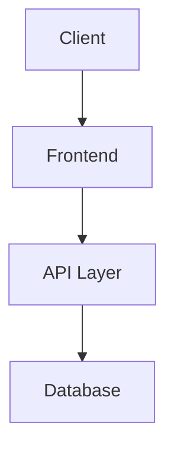

# Architecture — {project.name}

> SACRED DOCUMENT — Changes require governance workflow.
> Generated by coldpress-os Phase 4: Planning.

---

## 1. Overview

### System Purpose
{One paragraph describing what this system does.}

### Key Design Decisions
| Decision | Rationale | ADR |
|----------|-----------|-----|
| | | |

---

## 2. System Architecture

### High-Level Diagram

### Component Overview
| Component | Responsibility | Technology |
|-----------|---------------|-----------|
| | | |

---

## 3. Data Model

### Core Entities
| Entity | Description | Key Fields |
|--------|-------------|-----------|
| | | |

### Relationships
{Describe entity relationships.}

---

## 4. API Design

### Endpoints Overview
| Endpoint | Method | Purpose |
|----------|--------|---------|
| | | |

### Authentication & Authorization
{Describe auth approach.}

---

## 5. Infrastructure

### Environments
| Environment | Purpose | URL |
|------------|---------|-----|
| Development | | |
| Staging | | |
| Production | | |

### Deployment Strategy
{Describe deployment approach.}

---

## 6. Security

### Threat Model
{Key security considerations.}

### Data Protection
{How sensitive data is handled.}

---

## 7. Performance

### Targets
| Metric | Target |
|--------|--------|
| Page load | |
| API response | |
| Uptime | |

### Scaling Strategy
{How the system scales.}

---

## 8. Cross-Cutting Concerns

### Logging & Monitoring
{Approach to observability.}

### Error Handling
{Error handling strategy.}

---

### Version Control

| Version | Date | Author | Changes |
|---------|------|--------|---------|
