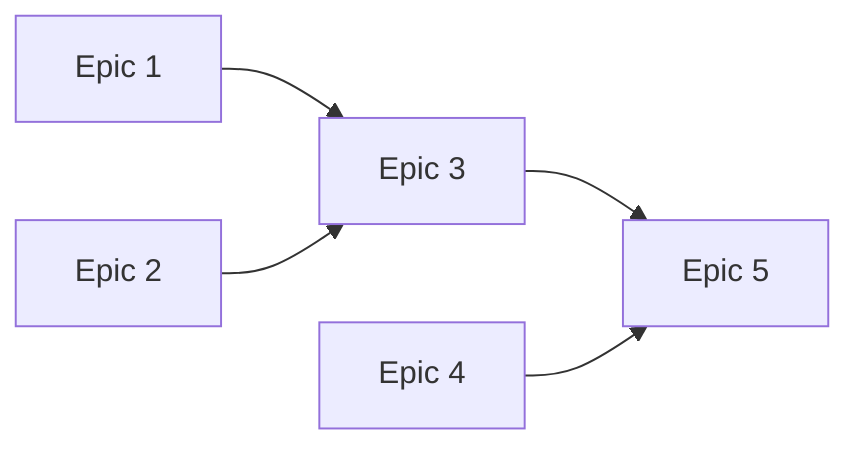

# PERT Chart — {project.name}

> SACRED DOCUMENT — Changes require governance workflow.
> Generated by coldpress-os Phase 5: Breakdown.

---

## Project Summary

| Metric | Value |
|--------|-------|
| Total epics | |
| Total waves | |
| Critical path length | |
| Estimated calendar time (sequential) | |
| Estimated calendar time (parallel) | |
| Time saved via parallelization | |

---

## Dependency DAG



---

## Wave Grouping

### Wave 1 — {description}
| Epic | Name | Estimated Effort | Dependencies |
|------|------|-----------------|-------------|
| | | | None (entry wave) |

**Gate:** {what must be true before Wave 2 starts}

### Wave 2 — {description}
| Epic | Name | Estimated Effort | Dependencies |
|------|------|-----------------|-------------|
| | | | |

**Gate:** {what must be true before Wave 3 starts}

---

## Critical Path

```
{Epic X} → {Epic Y} → {Epic Z}
Total: {N} days/sprints
```

The critical path determines the minimum project duration regardless of parallelization.

---

## Human Gate Points

| Gate | After Wave | Decision Required |
|------|-----------|-------------------|
| | 1 | |
| | 2 | |

---

## Risk Factors

| Risk | Impact | Mitigation |
|------|--------|-----------|
| | | |

---

### Version Control

| Version | Date | Author | Changes |
|---------|------|--------|---------|
