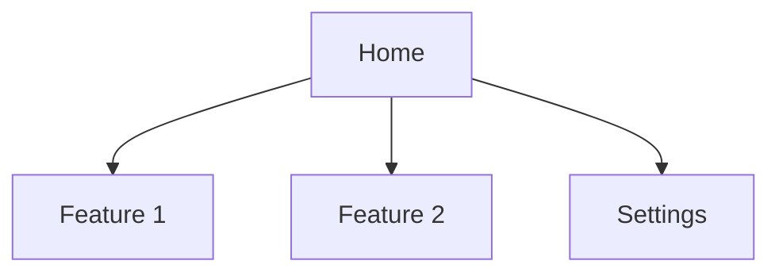
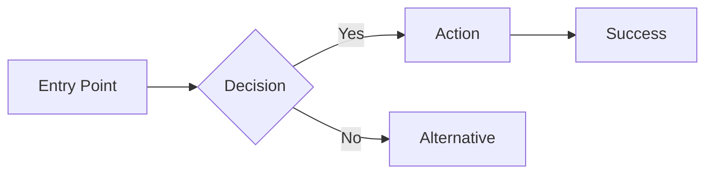

# UX Design Specification — {{project_name}}

> Generated by coldpress-os Phase 4: Planning.

**Author:** {{user_name}}
**Date:** {{date}}
**Mode:** {{standard / full-spec}}

---

## 1. Design Overview

### Design Principles
- {Principle 1 — e.g., "Simplicity over feature density"}
- {Principle 2}
- {Principle 3}

### User Personas (from PRD)
| Persona | Primary Goal | Key Frustration |
|---------|-------------|-----------------|
| | | |

---

## 2. Information Architecture

### Site Map / App Structure

### Navigation Pattern
- Primary: {tab bar / sidebar / top nav}
- Secondary: {breadcrumbs / back button}

---

## 3. User Flows

### Flow: {Primary User Flow Name}

**Entry point:** {Where the user starts}
**Happy path:** {Steps 1 → 2 → 3}
**Error states:** {What happens when X fails}

---

## 4. Key Screens

### Screen: {Name}

**Purpose:** {What the user accomplishes here}
**Entry from:** {Previous screen/flow}
**Exits to:** {Next screen/flow}

**Layout:**
- Header: {description}
- Main content: {description}
- Actions: {primary CTA, secondary actions}

**Components:**
| Component | Type | Behavior |
|-----------|------|----------|
| | | |

**States:**
- Default: {description}
- Loading: {description}
- Empty: {description}
- Error: {description}

---

## 5. Interaction Patterns

| Pattern | Usage | Behavior |
|---------|-------|----------|
| Form submission | {Where} | {Validation, loading, success/error feedback} |
| List/table | {Where} | {Pagination, sorting, filtering} |
| Modal/dialog | {Where} | {Open trigger, close behavior, focus trap} |
| Toast/notification | {Where} | {Duration, dismissal, stacking} |

---

## 6. Responsive Strategy

| Breakpoint | Width | Layout Changes |
|-----------|-------|----------------|
| Mobile | < 640px | {Single column, bottom nav} |
| Tablet | 640-1024px | {Two column, sidebar collapses} |
| Desktop | > 1024px | {Full layout, persistent sidebar} |

---

## 7. Accessibility

- Color contrast: {WCAG AA/AAA}
- Focus indicators: {visible on all interactive elements}
- Screen reader: {semantic HTML, ARIA labels where needed}
- Keyboard: {all actions reachable via keyboard}
- Motion: {respects prefers-reduced-motion}

---

## 8. Design Tokens (if full-spec mode)

### Colors
| Token | Value | Usage |
|-------|-------|-------|
| --color-primary | | |
| --color-surface | | |
| --color-text | | |

### Typography
| Token | Value | Usage |
|-------|-------|-------|
| --font-body | | |
| --font-heading | | |

### Spacing
| Token | Value |
|-------|-------|
| --space-sm | |
| --space-md | |
| --space-lg | |

---

### Version Control

| Version | Date | Author | Changes |
|---------|------|--------|---------|
